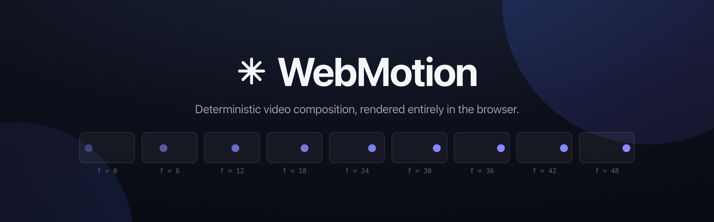

<p align="center">
  
</p>

<p align="center">
  <a href="https://www.npmjs.com/package/@superhq/webmotion"></a>
  <a href="./LICENSE"></a>
</p>

**WebMotion** is a browser-native alternative to [Remotion](https://www.remotion.dev/). No headless Chrome, no FFmpeg, no render farm: compose in the DOM or on a canvas, encode with WebCodecs, and download an MP4, all client-side.

It rests on one rule: **everything visible is a pure function of the current frame.** Seeking to frame _N_ always produces the same image, whether it's the first frame rendered or the ten-thousandth, in preview or in export. That is what makes rendering seekable, cacheable, and frame-accurate without a server.

## Install

```bash
npm install @superhq/webmotion
```

## Start a project

Prefer a ready-made setup? Scaffold a Vite project with a live preview, a zoomable scrub timeline (section labels and an audio lane), and one-click MP4 export:

```bash
npx degit superhq-ai/webmotion/template my-video
cd my-video
npm install
npm run dev
```

Then author your video in `src/scene.js` and the preview reloads as you save. See [template/README.md](./template/) for the details.

## Write video in HTML

Import the elements entry once and the scene is just markup:

```html
<script type="module">
  import "@superhq/webmotion/elements";
</script>

<w-composition width="1280" height="720" fps="30" duration="150" autoplay>
  <w-defs>
    <w-animation name="fade-up">
      <w-animate property="opacity" from="0"  to="1" start="0" end="18" easing="easeOutCubic"></w-animate>
      <w-animate property="y"       from="40" to="0" start="0" end="18" easing="easeOutCubic"></w-animate>
    </w-animation>
  </w-defs>

  <w-rect x="0" y="0" width="1280" height="720" fill="#0d101b"></w-rect>

  <w-sequence from="12">
    <w-text motion="fade-up" x="0" y="250" width="1280" align="center"
            font="700 96px system-ui" color="#f5f6f8">Author in HTML.</w-text>
  </w-sequence>
</w-composition>
```

A `<w-sequence from duration>` shifts the frame origin for its subtree; a `<w-animate>` is one tween of one property over a frame window, pure function of the local frame, so the live preview and the exported video are pixel-for-pixel the same scene. Tweens can be written inline as children for one-offs, or defined once in `<w-defs>` and applied by name with `motion="..."`, class-like. The full rules (scoping, ordering, staggering through sequences) are in the [motion spec](./docs/MOTION.md). Repetition is declarative too: `<w-for>` stamps templated children from `<w-data>` JSON with `{path + arithmetic}` placeholders ([template spec](./docs/TEMPLATE.md)); sound is `<w-audio>` on the same timeline ([audio spec](./docs/AUDIO.md)); cuts and dissolves between scenes are one element, `<w-transition>`, a frame-pure dither, wipe, or iris plate that stays cheap at export ([transitions](./docs/TRANSITIONS.md)). For previewing there is a standard transport, `<w-player>`: wrap the composition and get play controls, a zoomable scrub timeline with chapter labels from `<w-sequence label>` and an audio lane, volume and mute, fullscreen, and keyboard control ([player spec](./docs/PLAYER.md)).

The element drives itself:

```js
const comp = document.querySelector("w-composition");
comp.play();
comp.seek(42); // deterministic: always the exact same image
const blob = await comp.export(); // MP4, encoded in the browser
```

## Or write video in TypeScript

The programmatic API underneath is a small component contract: `renderFrame` receives a frame index and draws.

```ts
import { Composition, Runtime, Layer, Sequence, CanvasRenderer, interpolate, Easing } from "@superhq/webmotion";

const composition = new Composition({ width: 1280, height: 720, fps: 30, durationInFrames: 180 });

class Title {
  mount() {}
  renderFrame({ ctx, frame, width, height }) {
    ctx.globalAlpha = interpolate(frame, [0, 20], [0, 1], { easing: Easing.easeOutCubic, extrapolateRight: "clamp" });
    ctx.fillStyle = "#fff";
    ctx.font = "600 84px system-ui";
    ctx.textAlign = "center";
    ctx.fillText("WebMotion", width / 2, height / 2);
  }
  destroy() {}
}

const runtime = new Runtime({
  composition,
  renderer: new CanvasRenderer(1280, 720, { canvas }),
  layers: [new Layer({ component: new Title(), sequence: new Sequence({ from: 20 }) })],
});

await runtime.renderFrame(30); // draws exactly frame 30, every time
```

Prefer real DOM over canvas drawing? The `@superhq/webmotion/html-in-canvas` backend renders live HTML and rasterizes it per frame. It is named after, and tracks, the [WICG html-in-canvas proposal](https://github.com/WICG/html-in-canvas): today a foreignObject rasterizer stands in as the polyfill, and the native APIs take over when browsers ship them. See the [architecture notes](./docs/ARCHITECTURE.md) for that and everything else.

Need 3D? Install `three` and import `@superhq/webmotion/three` to get `<w-model>`: an animated glTF entity whose clips run on the frame clock, composited with everything above and exported deterministically. See [THREE.md](./docs/THREE.md).

Got raw footage? Install `mp4box` and import `@superhq/webmotion/video` to get `<w-video>`: a video clip decoded frame-exact with WebCodecs, drawn on a live canvas, with its audio folded into the export mix. See [VIDEO.md](./docs/VIDEO.md).

## The site

**Live: [webmotion.superhq.ai](https://webmotion.superhq.ai/)** - the hero there is a live
composition you can scrub frame by frame and export to MP4 in the page.

Run it locally:

```bash
git clone https://github.com/superhq-ai/webmotion && cd webmotion
npm install
npm run demo
```

The site is an Astro + Tailwind project in [`site/`](./site); `npm run demo:build` writes the
static build to `site/dist`. Its scenes live in [`site/src/scenes/`](./site/src/scenes) and its
assets are generated by the scripts in [`scripts/`](./scripts). `npm run bench` serves the
rasterizer bench in [`examples/`](./examples), a dev harness for measuring the html-in-canvas
path. Export needs a Chromium-based browser (WebCodecs H.264 and `OffscreenCanvas`).

## AI skill

`skills/webmotion/` is an installable agent skill that teaches AI coding agents to author WebMotion scenes: the element reference, motion rules, styling guidance, export wiring, and launch-film recipes with pacing craft.

Install with the [skills CLI](https://github.com/vercel-labs/skills) (works with Claude Code, Cursor, Copilot, and 15+ other agents):

```bash
npx skills add superhq-ai/webmotion
```

Or copy the folder directly for Claude Code:

```bash
npx -y degit superhq-ai/webmotion/skills/webmotion ~/.claude/skills/webmotion
```

Then ask for a video ("make me a 10 second launch film for X") and the agent knows the format.

## Look at a scene without opening a browser

An agent writing a video is working blind: it can author 240 frames of timing and never see a pixel. The `webmotion` command closes that loop.

```bash
npx webmotion shoot          # PNGs of the key frames, into .webmotion/shots
npx webmotion lint           # what is mechanically wrong with the scene
```

Both take a scene entry and fall back to `src/scene.js`, `scene.js`, or `index.html` in the working directory. Either the starter's `config` + `scene` module or a plain HTML page holding a `<w-composition>` works.

`shoot` picks its frames from the scene's own structure: the first frame, the last, and the start, middle, and end of every labelled `<w-sequence>`. Override with `--frames 0,45,120`.

`lint` reports what a contact sheet is worst at showing: two tweens fighting over one property, text overflowing its box, an entity that never makes it into the frame, an asset that will export as a hole, a font stack that resolves to nothing, a labelled beat where nothing moves. It exits non-zero when it finds an error, so it works in CI as well as in a loop.

Both drive a real browser through Playwright, using your installed Chrome when there is one:

```bash
npm install --save-dev playwright
```

Every rule, what it means, and how to fix it: [CLI.md](./docs/CLI.md).

## Agent plugin

The same thing, packaged as a plugin with commands: `/webmotion:create-video` writes a video from a brief and checks the frames, `/webmotion:review-scene` critiques an existing one, `/webmotion:edit-scene` makes a targeted change and verifies it.

```bash
# Claude Code
claude plugin marketplace add superhq-ai/webmotion
claude plugin install webmotion@webmotion

# Codex
codex plugin marketplace add superhq-ai/webmotion
codex plugin add webmotion@webmotion
```

One package serves both: Codex reads the same `.claude-plugin/plugin.json`.

## Development

```bash
npm test           # unit tests (Node, no browser needed)
npm run typecheck
npm run build      # tsc -> dist/
```

## License

[MIT](./LICENSE). The HTML rasterizer is a derivative of MIT-licensed work by [repalash](https://github.com/repalash); see [CREDITS](./src/html-in-canvas/CREDITS.md).
